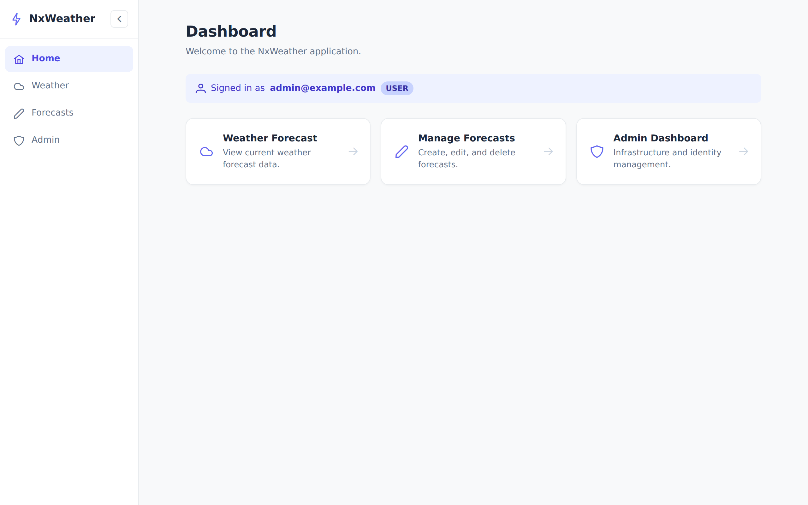
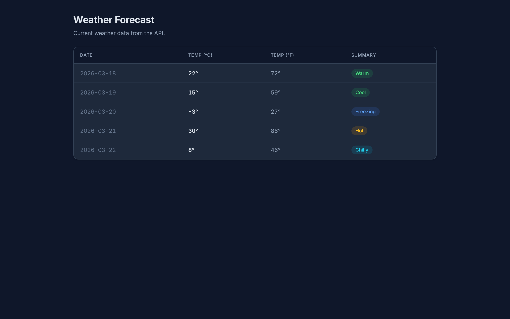
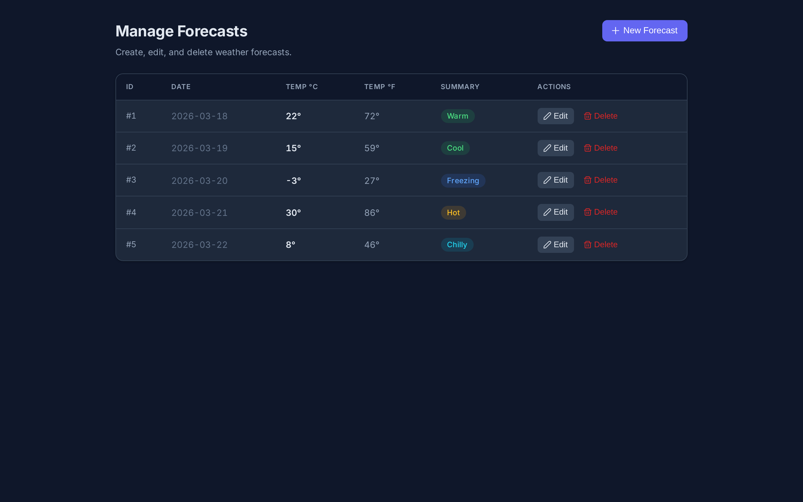
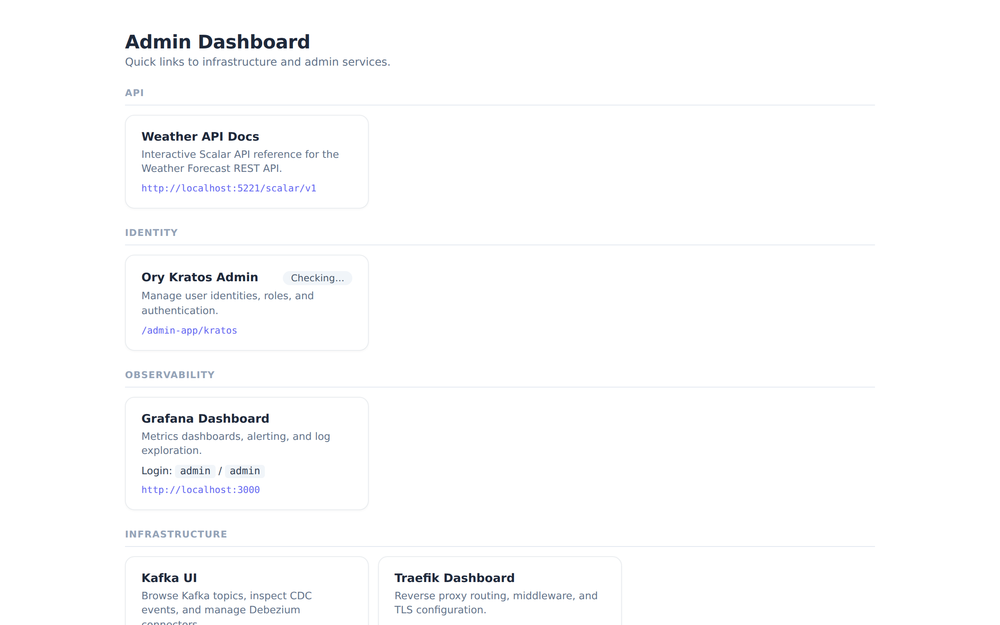
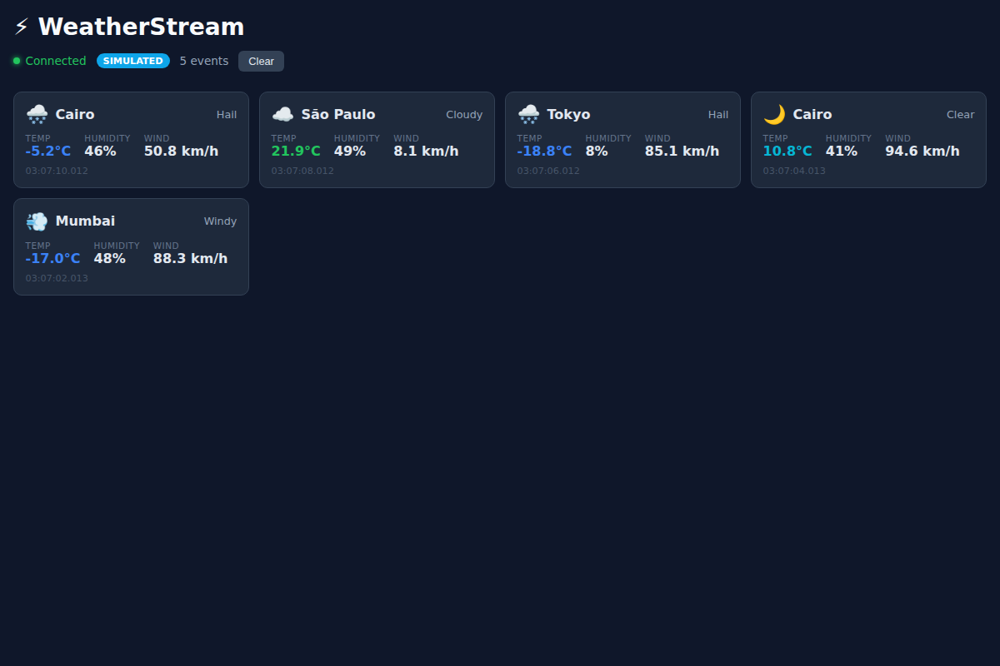

# claude-hello-world

[](https://github.com/joebarbere/claude-hello-world/actions/workflows/ci.yml)
[](https://github.com/joebarbere/claude-hello-world/actions/workflows/eks-e2e.yml)
[](https://github.com/joebarbere/claude-hello-world/actions/workflows/dependency-check.yml)
[](https://github.com/joebarbere/claude-hello-world/actions/workflows/codeql.yml)
[](https://github.com/joebarbere/claude-hello-world/blob/main/.github/dependabot.yml)

What started as a simple "hello world" became an absurdly over-engineered, weather-themed Nx monorepo — a full-stack playground built entirely through conversation with [Claude Code](https://claude.ai/code). It spans Angular Module Federation micro-frontends, a .NET 9 Weather API, real-time Kafka event streaming via an Electron desktop app, Change Data Capture with Debezium, a complete observability stack (Prometheus + Grafana + Loki), a data science platform (Airflow + Jupyter + MinIO), Ory Kratos identity management with SSO across every service, and more — all containerized with Podman and orchestrated via `podman play kube` with Traefik SSL termination tying it all together.

> **This project is for learning [Claude Code](https://claude.ai/code) only. It is not intended for production use.** See the [Security Disclaimer](#security-disclaimer) for details.

### Built with Claude Code

This entire monorepo — **260 commits**, **53,500+ lines of code**, and **188 documented build steps** — was produced in just **21 days** (March 7–28, 2026) through a single human collaborating with Claude Code. Every application, every container image, every Kubernetes pod manifest, every Grafana dashboard, every Airflow DAG, every Playwright E2E test, and every line of this README was written through natural language conversation. The [SUMMARY.md](SUMMARY.md) chronicles every step of the journey, from the first `nx g @nx/angular:app` scaffold to wiring SSO across five independent services. This is what happens when you hand an AI pair programmer a blank repo and say "let's build something."

### Tech Stack

| Technology | Role |
|---|---|
| **Nx 22** | Monorepo orchestration, task caching, dependency graph, and code generation |
| **Angular 21** | Frontend framework for all micro-frontend applications |
| **Module Federation (Webpack)** | Micro-frontend architecture — shell host with independently deployable remotes |
| **PrimeNG 21** | UI component library (Aura theme, dark mode) with shared design system |
| **TypeScript 5.9** | Type-safe language across all frontend and tooling code |
| **Vite / SWC** | Fast dev server and Rust-based transpiler for frontend builds |
| **.NET 9 / ASP.NET Core** | Weather API backend with OpenAPI docs (Scalar) |
| **Entity Framework Core 9** | ORM with PostgreSQL provider (Npgsql) for weather data persistence |
| **PostgreSQL 17** | Primary relational database with logical replication enabled for CDC |
| **Ory Kratos** | Self-hosted identity and access management — login, registration, sessions, RBAC |
| **Traefik 3.3** | Reverse proxy with SSL termination, path-based routing, and forwardAuth SSO |
| **nginx** | Static file server for production Angular builds inside containers |
| **Podman** | OCI-compliant container runtime (rootless, daemonless Docker alternative) |
| **Kubernetes (podman play kube)** | Pod orchestration using standard K8s YAML manifests |
| **Apache Kafka 3.9 (KRaft)** | Event streaming broker — no Zookeeper, single-node KRaft mode |
| **Debezium** | Change Data Capture — streams PostgreSQL WAL changes to Kafka topics |
| **Confluent Schema Registry** | Avro schema storage and compatibility enforcement for Kafka messages |
| **KafkaJS** | JavaScript Kafka client for the Electron desktop consumer |
| **Kafka UI** | Web interface for browsing topics, connectors, and Avro schemas |
| **Electron** | Desktop app (Lightning App) — native Kafka consumer with Angular renderer |
| **Prometheus** | Metrics collection and alerting — scrapes 11 targets across all services |
| **Grafana** | Dashboards for Weather API, System Health, and Kafka & CDC metrics |
| **Loki** | Log aggregation with label-based queries (tsdb/filesystem backend) |
| **Promtail** | Log shipper — collects CRI pod logs, container logs, and access logs |
| **Blackbox Exporter** | HTTP endpoint probing for Airflow and Jupyter health checks |
| **postgres-exporter** | PostgreSQL metrics — replication slot lag and status |
| **nginx-exporter** | nginx connection and request metrics for Prometheus |
| **Podman Exporter** | Container and pod state metrics via the Podman API |
| **Apache Airflow 2.10** | DAG-based workflow orchestration for data pipelines |
| **Jupyter Lab** | Interactive notebooks with DuckDB, pandas, and pyarrow |
| **MinIO** | S3-compatible object storage for datasets and artifacts |
| **DuckDB** | Embedded columnar analytics database for notebook and DAG queries |
| **pandas / pyarrow / boto3** | Data manipulation, Arrow format support, and S3 API access |
| **fastavro / confluent-kafka** | Avro serialization and Kafka consumption in Python |
| **auth-proxy** | Custom SSO bridge — validates Kratos sessions for Grafana, Airflow, Jupyter, MinIO |
| **slot-guard** | Custom safety net — monitors and drops stale Debezium replication slots |
| **Playwright** | E2E browser testing across three test suites (shell, weather, CRUD) |
| **Vitest** | Unit test framework (Vite-native, with V8 coverage) |
| **xUnit / dotnet test** | .NET backend unit and integration testing |
| **ESLint 9 / Prettier** | Linting and code formatting across the monorepo |
| **GitHub Actions** | CI/CD — lint, build, E2E smoke + full suites, Claude Code review |
| **CodeQL** | Static application security testing (SAST) |
| **OWASP Dependency-Check** | Software composition analysis for known vulnerabilities |
| **Dependabot** | Automated dependency updates for npm, NuGet, and GitHub Actions |
| **OpenSSL** | Self-signed TLS certificate generation for local HTTPS |

---

## Table of Contents

- [Demo](#demo)
- [Architecture](#architecture)
- **Getting Started**
  - [Prerequisites](#prerequisites)
  - [SSL / HTTPS](#ssl--https)
  - [Development](#development)
  - [Build](#build)
  - [Run (containers)](#run-containers)
- **Applications**
  - [Shared UI Library](#shared-ui-library)
  - [WeatherStream App](#weatherstream-app-weatherstream-app)
  - [Lightning App](#lightning-app-lightning-app)
- **Infrastructure**
  - [Authentication](#authentication)
  - [Observability](#observability)
  - [Kafka & CDC](#kafka--cdc)
  - [Data Science](#data-science)
- **Testing**
  - [Test & Lint](#test--lint)
  - [E2E Tests (Playwright)](#e2e-tests-playwright)
  - [CI](#ci)
- [Weather API Repository Mode](#weather-api-repository-mode)
- [Security Disclaimer](#security-disclaimer)

---

## Demo

All apps use a dark-mode-first design with the Inter font and consistent indigo accent colors.

### Shell — Home Dashboard

The shell app is the Module Federation host. It provides the dark sidebar layout, navigation, and session-aware greeting banner.



### Weather Forecast (read-only)

Displays weather data from the .NET API in a dark-themed table with color-coded summary badges.



### Manage Forecasts (CRUD)

Full create, edit, and delete workflow for weather forecasts with dark form styling. Requires authentication.



### Admin Dashboard

Quick links to infrastructure and admin services — API docs, Kratos identity management, Grafana, Kafka UI, Traefik, and the data science stack (Airflow, Jupyter, MinIO).



## Architecture

```
Browser
  └── Shell (Angular MFE host, :4200 / :8443 HTTPS / :8080 HTTP→redirect)
        ├── weather-app (remote, :4201) — weather forecast table (public)
        ├── weatheredit-app (remote, :4202) — weather forecast CRUD (admin/weather_admin only)
        └── admin-app (remote, :4203) — admin UI (admin only)

Traefik (reverse proxy, :8080 → redirects to HTTPS, :8443 SSL termination)
  ├── /                        → nginx (static files) → shell app
  ├── /weather-app/            → nginx (static files) → weather-app remote
  ├── /weatheredit-app/        → nginx (static files) → weatheredit-app remote
  ├── /admin-app/              → nginx (static files) → admin-app remote
  ├── /weather                 → weather-api
  ├── /grafana                 → Grafana (:3000) [SSO via kratos-auth]
  ├── /airflow                 → Airflow (:8280) [SSO via kratos-auth]
  ├── /jupyter                 → Jupyter (:8888) [SSO via kratos-auth]
  ├── /minio-login             → auth-proxy (:4181) [SSO + auto-login] → localhost:9001
  ├── /.ory/kratos/public/     → Ory Kratos public API (:4433)
  └── /.ory/kratos/admin/      → Ory Kratos admin API (:4434)

nginx (container, :8080 internal — static file server only)
  ├── /                        → shell app
  ├── /weather-app/            → weather-app remote
  ├── /weatheredit-app/        → weatheredit-app remote
  └── /admin-app/              → admin-app remote

weather-api (.NET 9, :5220 dev / :5221 container)
  ├── GET endpoints — public
  └── POST/PUT/DELETE endpoints — restricted to admin and weather_admin roles

Ory Kratos (identity, :4433 public / :4434 admin)
  └── PostgreSQL-backed user store with role-based access (seeded on start by ory-kratos-init)

PostgreSQL 17 (:5432)

Observability (separate pod, not started by kube-up shell)
  ├── Prometheus (:9090) — metrics scraping and storage
  ├── Loki (:3100) — log aggregation (tsdb/filesystem backend)
  ├── Promtail — log collection from pod/container logs, traefik & nginx access logs
  ├── Grafana (:3000 / https://localhost:8443/grafana/) — dashboards, SSO via Kratos
  ├── auth-proxy (:4180 auth, :4181 MinIO auto-login) — Kratos session validation + MinIO SSO
  └── postgres-exporter (:9187) — scrapes pg_replication_slots metrics from PostgreSQL

Kafka CDC (separate pod, not started by kube-up shell)
  ├── Kafka (:9092) — KRaft single-node broker (no Zookeeper)
  ├── Schema Registry (:8081 / :8085 host) — Confluent Avro schema storage
  ├── Debezium Connect (:8083) — CDC from PostgreSQL → Kafka topics (Avro-encoded)
  ├── Kafka UI (:8090 / https://localhost:8443/kafka-ui/) — topic, connector, and schema browser
  └── slot-guard — replication slot lag monitor; drops stale slots >5 GB as a safety net

Data Science (separate pod, not started by kube-up shell)
  ├── Apache Airflow (:8280 / https://localhost:8443/airflow/) — DAG orchestration, SSO via Kratos
  ├── Jupyter Lab (:8888 / https://localhost:8443/jupyter/) — notebooks, SSO via Kratos
  └── MinIO (:9000 API / :9001 console via /minio-login) — S3 storage, SSO via Kratos auto-login
```

## Prerequisites

| Tool | Version |
|------|---------|
| Node.js | 20+ |
| .NET SDK | 9.0 |
| Podman | any recent |
| OpenSSL | any recent (for cert regeneration only) |

```sh
npm install
```

## SSL / HTTPS

Traefik serves as the SSL termination reverse proxy using a self-signed certificate for `localhost`.
HTTP on port 8080 automatically redirects to HTTPS on port 8443. nginx serves only static Angular files behind Traefik.

The certificate and private key are pre-generated in `ssl/` (`localhost.crt` + `localhost.key`). Per-OS scripts handle trust, removal, and regeneration:

| Action | Linux | macOS | Windows (PowerShell) |
|--------|-------|-------|----------------------|
| Trust cert | `sudo ./ssl/install-cert-linux.sh` | `./ssl/install-cert-macos.sh` | `.\ssl\install-cert-windows.ps1` |
| Remove cert | `sudo ./ssl/uninstall-cert-linux.sh` | `./ssl/uninstall-cert-macos.sh` | `.\ssl\uninstall-cert-windows.ps1` |
| Regenerate cert | `./ssl/generate-cert-linux.sh` | `./ssl/generate-cert-macos.sh` | `.\ssl\generate-cert-windows.ps1` |

<details>
<summary>Regeneration prerequisites & post-steps</summary>

- **Linux:** Requires `openssl` (`sudo apt install openssl` / `sudo dnf install openssl`)
- **macOS:** Uses the system `openssl`; Homebrew `openssl` also works
- **Windows:** Requires OpenSSL for Windows (`winget install ShiningLight.OpenSSL`, `choco install openssl`, or Git for Windows which bundles `openssl.exe`)

After regenerating, rebuild the Traefik image and re-trust the new cert:
```sh
npx nx podman-build traefik
# then run the appropriate install-cert script for your OS
```
</details>

## Development

```sh
# Start all apps with hot reload (Angular on :4200, remotes on :4201/:4202)
npx nx serve shell --devRemotes=weather-app,weatheredit-app

# Start weather API (required for weather data in dev)
NX_DAEMON=false npx nx serve weather-api
```

## Build

```sh
# Build all Angular apps (production)
npx nx build-all shell

# Build weather API
NX_DAEMON=false npx nx build weather-api

# Build container images
npx nx podman-build shell          # nginx image (Angular MFE static files)
npx nx podman-build traefik        # Traefik reverse proxy + SSL termination
npx nx podman-build weather-api    # .NET API image
npx nx podman-build postgres       # PostgreSQL image
npx nx podman-build ory            # Ory Kratos image + init image
npx nx run kafka:podman-build      # Kafka CDC images (debezium-connect, debezium-init, slot-guard)
npx nx podman-build datascience    # Data science images (airflow, jupyter; MinIO uses upstream image)
```

## Run (containers)

### All services via Kubernetes (recommended)

```sh
# Build images first, then start all pods
npx nx podman-build shell
npx nx podman-build traefik
npx nx podman-build weather-api
npx nx podman-build ory
npx nx kube-up shell

# Stop all pods
npx nx kube-down shell
```

| URL | Service |
|-----|---------|
| https://localhost:8443 | Shell (HTTPS) |
| https://localhost:8443/weather-app/ | Weather table (public, HTTPS) |
| https://localhost:8443/weatheredit-app/ | Weather CRUD (login required, HTTPS) |
| https://localhost:8443/admin-app/ | Kratos identity admin (admin only, HTTPS) |
| http://localhost:8080 | Redirects to HTTPS |
| http://localhost:5221/weatherforecast | Weather API (GET public, writes require auth) |
| localhost:4433 | Ory Kratos public API |
| localhost:4434 | Ory Kratos admin API |
| localhost:5432 | PostgreSQL |
| https://localhost:8443/grafana/ | Grafana (SSO via Kratos, requires observability pod) |
| http://localhost:9090 | Prometheus (requires observability pod) |
| http://localhost:3100 | Loki (requires observability pod) |
| https://localhost:8443/kafka-ui/ | Kafka UI (requires kafka pod) |
| http://localhost:8090 | Kafka UI direct (requires kafka pod) |
| http://localhost:9092 | Kafka broker (requires kafka pod) |
| http://localhost:8083 | Debezium Connect REST API (requires kafka pod) |
| http://localhost:8085 | Schema Registry (requires kafka pod) |
| https://localhost:8443/airflow/ | Airflow (SSO via Kratos, requires datascience pod) |
| https://localhost:8443/jupyter/ | Jupyter Lab (SSO via Kratos, requires datascience pod) |
| https://localhost:8443/minio-login | MinIO Console auto-login (SSO via Kratos → redirects to localhost:9001, requires datascience pod) |
| http://localhost:9001 | MinIO Console direct (requires datascience pod) |
| http://localhost:9000 | MinIO S3 API (requires datascience pod) |

### Individual containers

```sh
npx nx podman-up shell        # Angular MFE on :8080
npx nx podman-up weather-api  # Weather API on :5221

npx nx podman-down shell
npx nx podman-down weather-api
```

## Shared UI Library

All Angular applications share a common design system provided by the `@org/ui` library at `libs/shared/ui/`. It uses [PrimeNG](https://primeng.org/) with the Aura theme preset for a professional, minimal look.

### Components

| Component | Selector | Purpose |
|-----------|----------|---------|
| `LayoutComponent` | `<ui-layout>` | App shell with collapsible sidebar navigation and router outlet |
| `PageHeaderComponent` | `<ui-page-header>` | Page title, optional subtitle, and action slot |
| `CardComponent` | `<ui-card>` | Content card with subtle border and shadow |
| `StatusBadgeComponent` | `<ui-status-badge>` | Color-coded badges (cold/cool/mild/warm/hot, success/danger/neutral) |

### Usage

Import components from `@org/ui` in any Angular standalone component:

```typescript
import { PageHeaderComponent, CardComponent } from '@org/ui';

@Component({
  imports: [PageHeaderComponent, CardComponent],
  template: `
    <ui-page-header title="My Page" subtitle="Description"></ui-page-header>
    <ui-card>Content here</ui-card>
  `,
})
export class MyComponent {}
```

Add `provideSharedUI()` to the app config for PrimeNG theme and animations:

```typescript
import { provideSharedUI } from '@org/ui';

export const appConfig: ApplicationConfig = {
  providers: [...provideSharedUI()],
};
```

## Design

The application uses a **dark-mode-first** design system with consistent theming across all apps.

| Aspect | Details |
|--------|---------|
| **Theme** | PrimeNG Aura preset with dark mode enabled by default |
| **Font** | [Inter](https://rsms.me/inter/) via Google Fonts — optimized for screen readability |
| **Colors** | CSS custom properties in `libs/shared/ui/src/lib/styles/shared-styles.css` |
| **Palette** | Slate dark backgrounds (`#0f172a`, `#1e293b`) with indigo accents (`#818cf8`) |

All colors are managed through CSS variables (`--bg-body`, `--bg-surface`, `--text-primary`, `--accent`, etc.) defined in the shared styles file. Components use these variables instead of hardcoded hex values, ensuring visual consistency across the shell, admin, weather, and streaming apps.

## WeatherStream App (`weatherstream-app`)



Angular application that displays a real-time weather event streaming dashboard. Features:

- Live weather event cards showing temperature, humidity, wind speed, and conditions for cities worldwide
- Dark-themed responsive UI with animated event cards
- Kafka consumer integration via Electron IPC when running inside `lightning-app`
- Falls back to simulated weather events when running standalone in the browser
- Port: 4203 (dev server)

**Serve standalone:** `npx nx serve weatherstream-app`

## Lightning App (`lightning-app`)

Electron desktop application that hosts `weatherstream-app` and provides native Kafka connectivity. Architecture:

- **Main process** — Connects to Kafka via `kafkajs`, consumes from `weather-events` topic
- **Preload script** — Exposes `electronKafka` API via `contextBridge` (context isolation enabled)
- **Renderer** — Loads `weatherstream-app` Angular build, receives weather events over IPC

**Serve (dev mode):** `npx nx serve-dev lightning-app`
**Serve (production build):** `npx nx serve lightning-app`

<details>
<summary>Environment variables</summary>

| Variable | Default | Description |
|----------|---------|-------------|
| `KAFKA_BROKERS` | `localhost:9092` | Comma-separated Kafka broker addresses |
| `KAFKA_TOPIC` | `weather-events` | Kafka topic to consume |
| `KAFKA_GROUP_ID` | `lightning-app-group` | Consumer group ID |
</details>

## Authentication

Access to the **weatheredit-app** and all **write operations** on the weather-api is restricted to users with `admin` or `weather_admin` roles, enforced by [Ory Kratos](https://www.ory.sh/kratos/).

### Default users

| User | Email | Password | Role |
|------|-------|----------|------|
| Admin | `admin@example.com` | `Admin1234!` | `admin` |
| Weather Admin | `weatheradmin@example.com` | `WeatherAdmin1234!` | `weather_admin` |

> **Note:** Change these credentials before deploying to any non-local environment.

### Auth flow

1. Navigate to `/weatheredit-app` — the Angular auth guard checks your Kratos session.
2. If unauthenticated, you are redirected to `/auth/login` which initiates a Kratos browser login flow.
3. After successful login, your session is set via a cookie and you are redirected back.
4. The weather-api independently validates the session cookie on every write request.

## Observability

The observability stack runs as a **separate pod** and is never started by `kube-up shell` or during e2e tests. It provides metrics, log aggregation, and dashboards for local development.

### Components

| Component | Port | Purpose |
|-----------|------|---------|
| Prometheus | 9090 | Scrapes metrics from weather-api, nginx-exporter, traefik, postgres-exporter, Debezium, and itself |
| Loki | 3100 | Log storage (single-instance, filesystem backend) |
| Promtail | — | Collects CRI pod logs, Podman container logs, and Traefik/nginx access logs; ships to Loki |
| Grafana | 3000 | Dashboards and log exploration; served at `https://localhost:8443/grafana/` via Traefik |
| auth-proxy | 4180, 4181 | Validates Kratos sessions for SSO (Traefik forwardAuth) and provides MinIO auto-login |
| postgres-exporter | 9187 | Scrapes `pg_replication_slots` metrics from PostgreSQL for CDC lag visibility |
| Blackbox exporter | 9115 | HTTP probes for Airflow and Jupyter health endpoints |
| Podman exporter | 9882 | Pod and container metrics via the Podman API (TCP) |

### Grafana dashboards

Three pre-provisioned dashboards at `https://localhost:8443/grafana/` (SSO via Kratos):

- **Weather API** — HTTP request rate, p99 latency, in-flight requests, process memory, nginx active connections
- **System Health** — system health %, service probes (Airflow, Jupyter), pods & containers by state, container health table, HTTP request/error rates by service, top IP + User-Agent, recent error logs (status >= 400)
- **Kafka & CDC** — replication slot lag (bytes), slot active status, Debezium time-behind-source, events processed rate, queue capacity, connector task status (requires kafka pod)

Grafana Explore and Logs Drilldown are also enabled for ad-hoc log queries against Loki.

<details>
<summary>Metrics scraped by Prometheus</summary>

| Target | Endpoint | Metrics |
|--------|----------|---------|
| weather-api | `host.containers.internal:5221/metrics` | ASP.NET Core HTTP metrics via `prometheus-net` |
| nginx | `host.containers.internal:9113` | Connection stats via `nginx-prometheus-exporter` sidecar |
| traefik | `host.containers.internal:8081/metrics` | Request counts, error rates, latency histograms |
| postgres | `localhost:9187` | Replication slot lag and status via `postgres-exporter` |
| debezium | `host.containers.internal:9404` | CDC consumer lag and throughput via JMX Prometheus agent |
| grafana | `localhost:3000/grafana/metrics` | Grafana internal metrics |
| loki | `localhost:3100/metrics` | Loki internal metrics |
| kratos | `host.containers.internal:4434/admin/metrics/prometheus` | Ory Kratos identity metrics |
| minio | `host.containers.internal:9000/minio/v2/metrics/cluster` | MinIO cluster metrics |
| blackbox | `localhost:9115` | HTTP probe results for Airflow and Jupyter health endpoints |
| podman | `host.containers.internal:9882` | Pod and container state metrics via `prometheus-podman-exporter` |
| prometheus | `localhost:9090` | Self-scrape |
</details>

<details>
<summary>Logs collected by Promtail</summary>

| Source | Path |
|--------|------|
| CRI pod logs | `/var/log/pods/*/*/*.log` |
| Podman container logs | `/var/lib/containers/storage/overlay-containers/*/userdata/ctr.log` |
| Traefik access logs | `/var/log/traefik/access.log` (JSON — client IP, User-Agent, status, route) |
| nginx access logs | `/var/log/nginx/access.log` (JSON — remote_addr, request, status, request_time) |
</details>

<details>
<summary>SSO via Ory Kratos</summary>

All protected services (Grafana, Airflow, Jupyter, MinIO) use the same SSO pattern:

1. Traefik routes the service path through a `forwardAuth` middleware (`kratos-auth`) to the auth-proxy on port 4180
2. The auth-proxy reads the Kratos session cookie and calls `/sessions/whoami`
3. If valid, it returns `200` with `X-Webauth-User` and `Remote-User` headers; Traefik copies these to the proxied request
4. If invalid, it redirects to the Kratos login page with `return_to` pointing back to the original URL
5. Each service consumes the identity header differently:
   - **Grafana** — `auth.proxy` trusts `X-Webauth-User` and auto-creates/logs in the user
   - **Airflow** — FAB `AUTH_REMOTE_USER` + a plugin that copies `X-Webauth-User` to `REMOTE_USER` in WSGI environ
   - **Jupyter** — token/password auth disabled; access gated entirely at the Traefik layer
   - **MinIO** — `/minio-login` route calls MinIO's login API with admin credentials, sets the session cookie, and redirects to `http://localhost:9001` (full auto-login, accessed directly rather than via Traefik subpath)

> **macOS note:** Podman containers run inside a Linux VM. The `hostPath` volume mounts (`/var/log`, `/var/lib/containers`) refer to paths inside that VM, not the macOS host filesystem. Log collection works automatically when `kube-up shell` and `kube-up observability` are both running inside the same Podman Machine.
</details>

## Kafka & CDC

The Kafka pod runs as a **separate pod** and is never started by `kube-up shell`. It captures every row-level change from PostgreSQL (via Debezium logical replication) and publishes them to Kafka topics, enabling event-driven consumers to react to database mutations without polling.

### Components

| Container | Image | Port | Purpose |
|-----------|-------|------|---------|
| kafka | `apache/kafka:3.9` | 9092 | KRaft single-node broker (no Zookeeper) |
| schema-registry | `confluentinc/cp-schema-registry:7.7.1` | 8081 (container), 8085 (host) | Confluent Schema Registry for Avro schema storage and evolution |
| debezium-connect | `localhost/debezium-connect:latest` | 8083 (REST), 9404 (JMX metrics) | CDC connector; reads Postgres WAL, Avro-encodes, and publishes to Kafka |
| debezium-init | `localhost/debezium-init:latest` | — | One-shot sidecar that registers the Postgres connector via REST |
| kafka-ui | `kafbat/kafka-ui:latest` | 8090 | Web UI for topics, connectors, and Avro schemas |
| slot-guard | `localhost/slot-guard:latest` | — | Periodically checks `pg_replication_slots`; drops inactive Debezium slots exceeding 5 GB lag |

### CDC flow

PostgreSQL has logical replication enabled (`wal_level=logical`). Debezium creates the `debezium_weather` replication slot and `dbz_publication` publication on the `appdb` database, then streams changes from all `public` schema tables. Topics are named with the prefix `weather` (e.g., `weather.public.WeatherForecasts`). Messages are Avro-encoded using Confluent Schema Registry — schemas are auto-registered on first write and can be browsed in Kafka UI.

<details>
<summary>Monitoring & alerting</summary>

**Three monitoring layers:**

| Layer | Source | What it measures |
|-------|--------|-----------------|
| `postgres_exporter` → Prometheus → Grafana | `pg_replication_slots` view | Byte lag accumulating in the WAL on the producer side |
| Debezium JMX → Prometheus → Grafana | Debezium JMX exporter (port 9404) | Time-behind-source lag on the consumer side |
| slot-guard | `pg_replication_slots` via `psql` | Last-resort automated cleanup — drops inactive slots >5 GB to prevent WAL disk exhaustion |

**Alerting thresholds:** Warning at >500 MB / inactive >10 min · Critical at >2 GB / inactive >30 min · Emergency (slot-guard auto-drops) at >5 GB.

> **macOS note:** The kafka pod uses `host.containers.internal` to reach the apps pod (Postgres). Both pods must be running inside the same Podman Machine.
</details>

## Data Science

The data science stack runs as a **separate pod** and is never started by `kube-up shell`. It provides workflow orchestration, interactive notebooks, and S3-compatible object storage for local data science development.

### Start / stop

```sh
npx nx run datascience:kube-up    # Build images and start the pod
npx nx run datascience:kube-down  # Stop the pod
```

### Components

| Component | Port | Image | Purpose |
|-----------|------|-------|---------|
| Apache Airflow | 8280 | `apache/airflow:slim-2.10.4-python3.11` | DAG-based workflow orchestration (SequentialExecutor + SQLite, dark mode default) |
| Jupyter Lab | 8888 | `quay.io/jupyter/minimal-notebook` + DuckDB | Interactive notebooks with DuckDB, pandas, pyarrow, boto3 (dark mode default) |
| MinIO | 9000 (API), 9001 (Console) | `quay.io/minio/minio` | S3-compatible object storage for datasets, models, and artifacts |

### Authentication

Airflow, Jupyter, and MinIO are all accessible via Traefik with Kratos SSO (see [SSO via Ory Kratos](#observability) for details). Use the admin dashboard links or the SSO URLs in the table above.

| Service | Auth method |
|---------|------------|
| Airflow | SSO via Kratos (`REMOTE_USER` header → FAB auto-login as Admin) |
| Jupyter Lab | SSO via Kratos (token/password disabled, access gated at Traefik) |
| MinIO Console | SSO via Kratos (auto-login with `minioadmin` / `minioadmin` credentials) |

### Pre-installed libraries

The Jupyter container ships with DuckDB (embedded analytical database), pandas, pyarrow, the MinIO Python client, and boto3 for S3 access. Airflow includes `duckdb-engine` (SQLAlchemy dialect) and the MinIO client.

### Persisting MinIO data

By default, MinIO data is stored in `/tmp/datascience/minio/data` which is lost on reboot. To persist objects across restarts:

```sh
# 1. Create a permanent directory
mkdir -p ~/datascience/minio/data

# 2. Edit k8s/datascience-pod.yaml — change the minio-data hostPath:
#    from: /tmp/datascience/minio/data
#    to:   /home/<your-user>/datascience/minio/data
```

The same pattern applies to `airflow-dags` and `jupyter-work` volumes if you want DAGs and notebooks to persist.

## Test & Lint

```sh
npx nx run-many --target=test --all
npx nx run-many --target=lint --all
```

## E2E Tests (Playwright)

Three Playwright suites test the apps running inside the EKS pods (Traefik on `:8080`/`:8443`). Each suite targets its app via `BASE_URL`:

| Suite | Default `BASE_URL` | Tests |
|-------|--------------------|-------|
| `shell-e2e` | `https://localhost:8443` | Home page, MFE navigation, `/weather` proxy |
| `weather-app-e2e` | `https://localhost:8443/weather-app/` | Forecast table headers, data rows, temperatures |
| `weatheredit-app-e2e` | `https://localhost:8443/weatheredit-app/` | Full CRUD — create, edit, delete, confirm/cancel |

### Run against local EKS pods

```sh
# 1. Start the pods
npx nx podman-build shell
npx nx podman-build weather-api
npx nx kube-up shell

# 2. Run each suite (BASE_URL defaults to the pod URLs above)
npx nx run shell-e2e:e2e
npx nx run weather-app-e2e:e2e
npx nx run weatheredit-app-e2e:e2e

# 3. Tear down
npx nx kube-down shell
```

### Run against a remote EKS cluster

```sh
BASE_URL=https://<eks-node>:8443                    npx nx run shell-e2e:e2e
BASE_URL=https://<eks-node>:8443/weather-app/       npx nx run weather-app-e2e:e2e
BASE_URL=https://<eks-node>:8443/weatheredit-app/   npx nx run weatheredit-app-e2e:e2e
```

## CI

| Workflow | Trigger | What it does |
|----------|---------|--------------|
| **CI** (`.github/workflows/ci.yml`) | push / PR | Lint + production build for all Angular apps |
| **EKS E2E Tests (Smoke)** (`.github/workflows/eks-e2e.yml`) | push to `main` | Builds all container images, starts EKS pods, runs `shell-e2e` only (verifies shell host, MFE navigation, and `/weather` API proxy), posts a result comment on the merged PR |
| **EKS E2E Tests (Full)** (`.github/workflows/eks-e2e-full.yml`) | manual (`workflow_dispatch`) | Same pod setup, but runs all three Playwright suites including full CRUD coverage for `weather-app-e2e` and `weatheredit-app-e2e` |

In CI, each Playwright config emits:
- **GitHub annotations** — inline pass/fail markers on the diff
- **HTML report** — uploaded as a 30-day artifact
- **JUnit XML** — consumed by `dorny/test-reporter` to create a Check Run visible in the PR Checks tab

## Weather API Repository Mode

Change `"Repository"` in `apps/weather-api/appsettings.json`:

| Value | Behavior |
|-------|----------|
| `"Random"` (default) | Read-only, no DB needed |
| `"InMemory"` | Full CRUD, in-process |
| `"EfCore"` | Full CRUD, PostgreSQL |

## Security Disclaimer

**DO NOT deploy this project to any internet-facing or shared environment.** It contains numerous intentional shortcuts that are insecure by design. The following issues exist in the codebase as shipped:

### Hardcoded secrets in source control

- **Kratos cookie and cipher secrets** (`apps/ory/kratos.yml`) are placeholder strings committed to the repository:
  ```yaml
  secrets:
    cookie:
      - CHANGE-ME-COOKIE-SECRET-32-CHARS!!
    cipher:
      - CHANGE-ME-CIPHER-SECRET-32-CHARS
  ```
  Anyone with read access to this repo can forge or decrypt Kratos session cookies.

- **PostgreSQL credentials** are hardcoded in `k8s/postgres-pod.yaml` and `k8s/ory-kratos-pod.yaml` (`appuser` / `apppassword`) and exposed as plaintext environment variables in the pod spec. They are also hardcoded in the `ConnectionStrings__DefaultConnection` passed to the weather-api container.

- **Default application user passwords** are hardcoded in `apps/ory/init-users.sh` and seeded on every fresh deployment:
  | Email | Password |
  |-------|----------|
  | `admin@example.com` | `Admin1234!` |
  | `weatheradmin@example.com` | `WeatherAdmin1234!` |

### TLS private key committed to the repository

- `ssl/localhost.key` — a private RSA key — is checked into source control. Any party with access to this repository can perform TLS interception or impersonation against any deployment using this certificate.

### Unauthenticated admin API exposed

- The **Ory Kratos admin API** (port `4434`) is bound to the host with no authentication, no network policy, and no firewall rule (`hostPort: 4434` in `k8s/ory-kratos-pod.yaml`). Anyone who can reach this port can create, modify, or delete identities without credentials.

### No Kubernetes Secrets — credentials in pod spec env vars

- All secrets (DB password, connection strings) are passed as plaintext `env` values directly in the pod spec files (`k8s/postgres-pod.yaml`, `k8s/ory-kratos-pod.yaml`, `k8s/apps-pod.yaml`) rather than Kubernetes `Secret` objects. They appear in `kubectl describe pod` output and are visible to any user with read access to the cluster or the repo.

### Self-signed TLS certificate

- The self-signed certificate in `ssl/localhost.crt` is not issued by any trusted CA. Browsers will reject it unless users manually install and trust it. No certificate rotation or expiry monitoring is in place.

### Plaintext credentials in Kratos DSN

- Kratos is configured with a PostgreSQL DSN that contains the database username and password in plaintext (`apps/ory/kratos.yml`). The connection string is committed to source control and visible to anyone with repo access.

### No rate limiting or brute-force protection on the login endpoint

- Traefik does not apply any rate limiting to `/.ory/kratos/public/`. The Kratos login flow has no lockout policy configured, making credential stuffing and brute-force attacks trivial.

### Kratos CORS allows all configured origins unconditionally

- The CORS `allowed_origins` list in `kratos.yml` includes development origins (`http://localhost:4200`) alongside production-style origins. Cross-origin requests from those origins are accepted for all methods including `POST`, `PUT`, `DELETE`, and `PATCH`.

### Client-side-only route guard for the Angular auth flow

- The Angular `weatherEditAuthGuard` is a client-side control. It can be bypassed by any user who modifies local state or disables JavaScript. The weather-api does enforce server-side session validation for write operations, but the Angular frontend itself is not a security boundary.

### No container image scanning

- Container images are built from base images (`node:20-alpine`, `nginx:alpine`, `traefik:v3.3-alpine`, `dotnet/sdk:9.0-alpine`, `postgres:17-alpine`, `oryd/kratos:v1.3.0-distroless`) with no CVE scanning, no image signing, and no dependency pinning beyond the tag.
